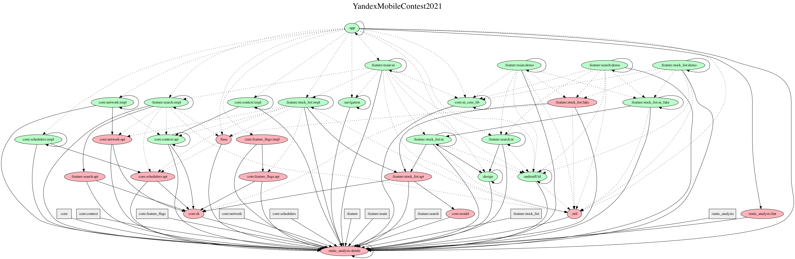

[](https://ktlint.github.io/)

## Stocks Viewer by Maxim Alov

Application displays a list of U.S. stocks and detailed info about each particular stock.
Stock prices are updating at real-time (if **FEATURE_FLAG_REAL_TIME_QUOTES_ENABLED** is enabled).
Data is cached as much as possible. Based on APIs listed below (sorted by prettiness):

- [Alpaca API](https://alpaca.markets/)
- [Tiingo API](https://api.tiingo.com/)
- [MBOUM API](https://mboum.com/)
- [Finnhub Open API](https://finnhub.io/)
- [Alpha Vantage API](https://www.alphavantage.co/)
- [Marketstack API](https://marketstack.com/)
- [Financial Modeling Prep API](https://site.financialmodelingprep.com/)
- [End Of Day Historical API](https://eodhistoricaldata.com/)

If using Finnhub API, first launch may be slow, because the App fetches data from Finnhub Backend using
it's poor API and tries to gracefully avoid & fallback it's strict limits.

Real-Time quotes updating is also implemented, but turned off. It could be turned on
by setting **FEATURE_FLAG_REAL_TIME_QUOTES_ENABLED** feature flag to **true**.
The App loads predefined set of stock issuers. It could be also configured by setting
feature flag **DEFAULT_STOCK_INDEX** to either **S&P500**, **NASDAQ** or **DOW**.
Feature flags reside in [core/feature_flags/impl/build.gradle](https://github.com/orcchg/YandexMobileContest2021/blob/master/core/feature_flags/impl/build.gradle) file.

Special for Yandex Mobile Contest 2021.
Special thanks to Yandex LLC for [design](https://www.figma.com/file/bfd6MTBekSVfUYBXWYnj1U/%D0%A8%D0%9C%D0%A0-%D0%A2%D0%B5%D1%81%D1%82%D0%BE%D0%B2%D0%BE%D0%B5)
Work is in progress. See [Issues](https://github.com/orcchg/YandexMobileContest2021/issues)

Contributions are quite encouraged.
The App is going to be published on Google Play soon.

## Architecture & Technical decisions

- Clean Arch + MVVM (based on Android Arch Components)
- Highly modularized project (core and feature modules + fakes, domain / data / ui layers, demo apps)
- Splitting of data layer to flexibly use different backend APIs w/o changes in code (see `:feature:data:*`)
- Standalone Design System (see `:design:*` modules) with extensive usage of latest Material Design practises
- Advanced build system based on Gradle 7 and precompiled script plugins
- Dependency Injection with Dagger 2 and multibinding, reusable core blocks
- Ubiquitous usage of RxJava and Uber's auto-dispose library
- Networking with OkHttp + Retrofit (rest) and Scarlet (web-socket)
- Local database with Room, cache-first solutions
- Navigation based on action ids and deeplinks with Navigation Lib and Safe Args from Jetpack
- Dynamic Feature Modules support (see `:feature:stock_details:stock_details_main`)
- Static analysis tools (ktlint, spotless, detekt) are also integrated and applied
- Algorithmic-based solutions (search by prefix based on case-insensitive Trie), covered with unit tests
- Kotlin 100% at best, extension functions, operators, etc.

Architecture is based on 3 layers: Data, Domain and Presentation. Each layer has it's own representation
in gradle projects (gradle modules). Let's consider `:feature:stock_list` module, it consists of the following:

- api       | feature's domain models + **FeatureInteractor** interface
- data      | the whole data layer of a feature
  - api     | a set of **FeatureRepository** intefaces
  - fake    | fake implementation of **FeatureRepository** interfaces
  - finnhub | real implementation of **FeatureRepository** interfaces based on Finnhub API
  - wiring  | di logic to wire the interfaces from `:api` with implementation
- demo      | standalone demo app with ui based on fake implementation
- fake      | fake implementation of **FeatureInteractor** and business logic
- impl      | real implementation of **FeatureInteractor** and business logic
- ui        | views that are specific to the feature (ex. SearchView, etc.)

For every product Feature there is a **FeatureInteractor** interface in `:api` which serves
as a provider of Feature's public functionality exposed to the others. Real implementation
of **FeatureInteractor** is hidden from any external client code. In `:api` there is also a
set of **Domain models** (POJO classes) specific to the Feature. Domain models are public and can
be used by any code accross the whole project. Another important building block is **FeatureApi**
interface (also in `:api`) that exposes **FeatureInteractor** for the others via DI, using Dagger's
component dependencies approach (see below).

There is a special case of gradle module - core library (here CoreLib). It provides an implementation
of some common logic and structures for the app, such as networking, analytics, etc. The module
structure of CoreLibs is the same - there is `:api` module that consists of domain models, a **CoreLibApi**
interface and a set of exposed interfaces, which are actually implemented in `:impl` module.

If some other part of client code or product feature wants to interact with the Feature,
it must depend only on it's `:feature:api` (or `:core:api`) module and invoke Feature's functionality
only from the **FeatureInteractor** (or whatever public interface from `:core:api`). Other product
features (client code) could use Feature's domain models freely. Sometimes Feature could also expose
some UI to the others, so it's available from `:feature:ui` module, which is highly based on standalone
Design System (given by `:design:*`).

Implementation of **FeatureInteractor** is given either by `:feature:impl` module (real implementation),
or by `:feature:fake` module (fake implementation). In order to quickly test Feature's functionality
during development there is `:feature:demo` module that provides a standalone Android application
only containing the Feature's functionality and UI. Demo apps use `:feature:fake` modules internally.

Thus, a tuple of `:feature:api`, `:feature:impl` and `:feature:fake` represents a **Domain Layer**
for the Feature, and it's `:feature:ui` and `:feature:demo` represents a **Presentation Layer**.
The presentation of the whole App reside in `:main:ui` module that depends on all product features
(except the dynamic ones) and accumulates the functionality and UI from each of them to build the
working production application.

**Data Layer** of the Feature is organized in a way that there is a `:data:api` module, which provides
**FeatureRepository** interfaces (there could be more than one depending on implementation logic)
and a number of "impl"-modules, such as `:data:fake` or `:data:finnhub` and others, which provides
an actual implementation for those **FeatureRepository** interfaces. For example, `:data:fake` provides
fake implementation for both RESTful- and WebSocket- powered repositories, while `:data:finnhub`
provides real implementation based on [Finnhub Open Stock API](https://finnhub.io/).
In order to wire api with implementation there is `:data:wiring` module which holds an internal DI
logic (based on Dagger 2) and exposes a Dagger Component **FeatureDataComponent** which actually
implements **FeatureDataApi** interface (from `:data:api`) exposing **FeatureRepositories** to `:feature:impl`.
In order to switch from one backend API to another (or to fake data source), one could just change
dependency in `:data:wiring` from `:data:backend_1` to `:data:backend_2` in gradle build script. That's it.
`:data:wiring` module utilizes the fact that it's bindings belongs to the same package regardless of
their gradle modules, so it could have it's DI logic written once and remain unchanged.

So, given a set of `:core:api` and `:feature:api` modules, providing **CoreLibApi** and **FeatureApi**
interfaces, we could use the latter to fill an internal key-value map, where key is a **CoreLibApi**/**FeatureApi**
interface and value is an implementation of it, which is actually a Dagger component **FeatureComponent**.
This is all done with Dagger's multibindings, see `:app` module for details. This gives us an easy way
to provide dependencies between core-libs and features while keeping them in isolation from each other
and allowing them to only use determined set of public functionality, given by **FeatureInteractor**. We use
Dagger component dependencies for it. CoreLib and Feature Dagger components reside in multibindings map
in Application and are exposed via **CoreLibApi**/**FeatureApi** interfaces for further usage. So, the
business logic of any CoreLib or Feature (given by **FeatureInteractor**) is always available and global.
A specific Feature's internal Dagger component on **Presentation Layer** might just use that business
logic by being dependent on **FeatureApi** component and inject bindings (that use business logic, i.e
**FeatureInteractor**) scoped by the Feature's UI lifecycle.

## Build System

Build system `:build-system` is provided as a standalone set of gradle build scripts and Kotlin code,
which is included to the main project via **include build** directive. So the main project is
essentially a [composite build](https://docs.gradle.org/current/userguide/composite_builds.html).

Build system provides a set of Gradle's precompiled script plugins (**convention plugins**) that
aggregate full logic need for each particular gradle module. For example, `:build-system:android-convention`
contains a number of precompiled script plugins that configure Android Library, Android App and
Android Dynamic Feature modules, and `:build-system:kotlin-convention` contains scripts that configure
plain Kotlin modules. There is no code duplication in gradle build scripts anymore, such **convention plugins**
are applied and handled via standard Gradle's `plugins {}` block.

A special module `:build-system:libraries` contains a set of 3rd-party dependencies and versions
well-organized. It is added as gradle **include build** into main project in order to provide the
latter with a convenient way to declare 3rd-party dependencies.

Code is also covered with static analysis tools (ktlint, spotless and detekt) which are configured
in `:build-system:static-analysis:*` modules also added into main project as an included build.

## How to build & launch

Simply execute the one of the following commands from the project's root directory:
```
./gradlew assembleDebug
```
or
```
./gradlew installDebug
```

## Project Dependency Graph


## License

Alov Maxim <alovmax@yandex.ru>. All right reserved.
This software belongs only to it's author. Please, contact to author if any questions.
Non-commercial use disclaimer:

This Work has been digitized in a public-private partnership. As part of this partnership,
the partners have agreed to limit commercial uses of this digital representation of the
Work by third parties. You can, without permission, copy, modify, distribute, display, or
perform the Item, for non-commercial uses. For any other permissible uses, please review
the terms and conditions of the organization that has made the Item available.

Unless expressly stated otherwise, the organization that has made this Item available makes
no warranties about the Item and cannot guarantee the accuracy of this Rights Statement.
You are responsible for your own use.

You may find additional information about the copyright status of the Item on the website
of the organization that has made the Item available.

You may need to obtain other permissions for your intended use. For example, other rights
such as publicity, privacy, or moral rights may limit how you may use the material.
