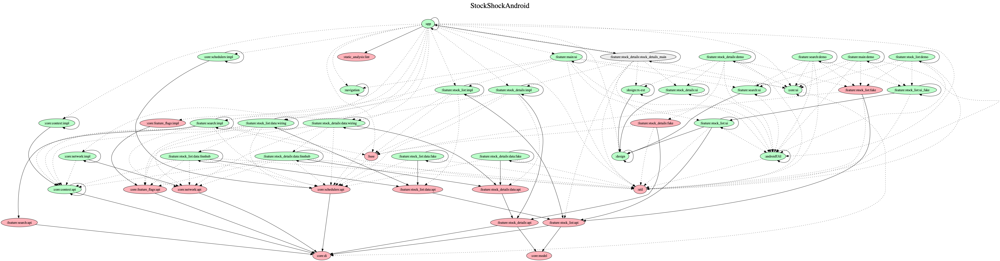

## Stocks Viewer by Maxim Alov

Special for Yandex Mobile Contest 2021. Based on [Finnhub API](https://finnhub.io/)

First launch may be slow, because the App fetches data from Finnhub Backed using
it's poor API and tries to gracefully avoid & fallback it's strict limits.

Special thanks to Yandex LLC for [design](https://www.figma.com/file/bfd6MTBekSVfUYBXWYnj1U/%D0%A8%D0%9C%D0%A0-%D0%A2%D0%B5%D1%81%D1%82%D0%BE%D0%B2%D0%BE%D0%B5)

Real-Time quotes updating is also implemented, but turned off. It could be turned on
by setting **FEATURE_FLAG_REAL_TIME_QUOTES_ENABLED** feature flag to **true**.
The App loads predefined set of stock issuers. It could be also configured by setting
feature flag **DEFAULT_STOCK_INDEX** to either **S&P500**, **NASDAQ** or **DOW**.
Feature flags reside in [core/feature_flags/impl/build.gradle](https://github.com/orcchg/YandexMobileContest2021/blob/master/core/feature_flags/impl/build.gradle) file.

Work is in progress. See [Issues](https://github.com/orcchg/YandexMobileContest2021/issues)

Contributions are quite encouraged.
The App is going to be published on Google Play soon.

## Project Dependency Graph

## License

Alov Maxim <alovmax@yandex.ru>. All right reserved.
This software belongs only to it's author. Please, contact to author if any questions.
Non-commercial use disclaimer:

This Work has been digitized in a public-private partnership. As part of this partnership,
the partners have agreed to limit commercial uses of this digital representation of the
Work by third parties. You can, without permission, copy, modify, distribute, display, or
perform the Item, for non-commercial uses. For any other permissible uses, please review
the terms and conditions of the organization that has made the Item available.

Unless expressly stated otherwise, the organization that has made this Item available makes
no warranties about the Item and cannot guarantee the accuracy of this Rights Statement.
You are responsible for your own use.

You may find additional information about the copyright status of the Item on the website
of the organization that has made the Item available.

You may need to obtain other permissions for your intended use. For example, other rights
such as publicity, privacy, or moral rights may limit how you may use the material.
